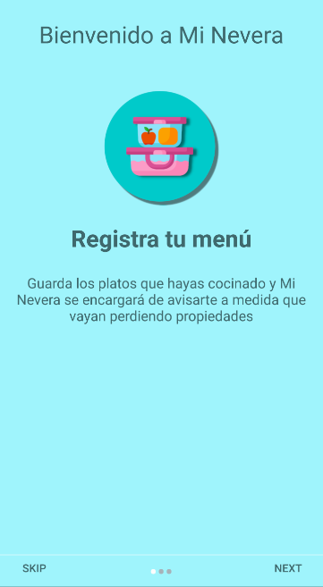
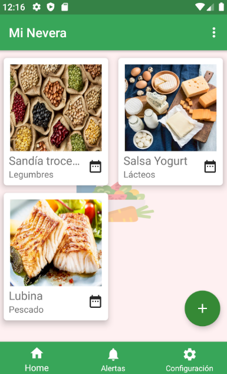
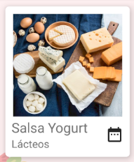
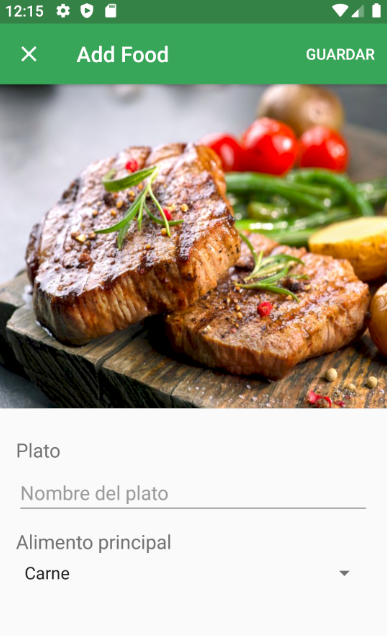
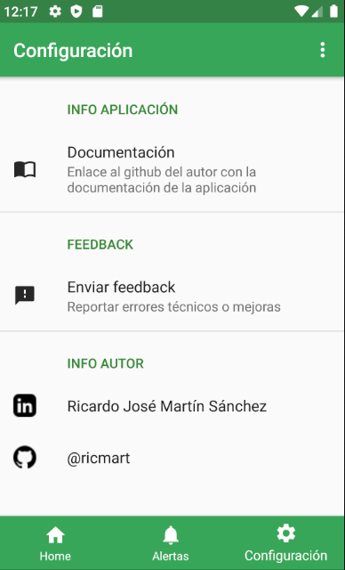

# Práctica Final Sistemas Móviles 19/20
Documentación de la práctica final de Sistemas Móviles del curso 2019/20 del alumno ricmart

Aplicación: Mi Nevera

Funcionalidad: La aplicación mi nevera se basa en una lista en la que puedes guardar platos cocinados y refrigerados de forma que en todo momento puedas consultar los platos que tienes en la nevera y de esa manera evitar que la comida se ponga mala. La aplicación permite registrar en una lista de dos columnas un nuevo plato de comida, que consta de un nombre de plato* y un alimento principal. En función del alimento principal la aplicación determina cuántos días durará el alimento en buen estado en el refrigerador. Al elegir un alimento principal, se cambia la fotografía representativa en función de éste.

Herramientas utilizadas: 

- Intro Slider: Para realizar un pequeño tutorial a modo de introducción que se ejecuta tan sólo la primera vez que abres la aplicación, he utilizado PageViewer y he modificado el archivo Manifest para ejecutar el Slider como Main Activity la primera vez.

- Lista de alimentos: Para mostrar la lista de alimentos he utilizado CardView + RecyclerView y para guardarlos en la base de datos he utilizado la librería Room, que permite implementar una base de datos de manera muy bien estructurada.

- Opciones de alimento en la vista de lista: Si mantienes pulsado en un alimento de la lista, se despliega un menú emergente que permite borrar ese elemento. Si se pulsa en cualquier parte del alimento se abrirá la pantalla de edición, mientras que si se pulsa sobre el icono de calendario que aparece en la esquina inferior derecha, se abrirá una ventana de diálogo que indica los días que faltan para que el alimento caduque.

- Alimentos: Cada alimento se compone de una imagen, un título y un alimento principal. La imagen del alimento va cambiando en función del alimento principal elegido, para ayudar al usuario a distinguir rápidamente de qué alimento se trata cada elemento de la lista.

- Alertas: En ella se muestran las últimas notificaciones recibidas para el alimento en cuestión. Así el usuario tendrá un recordatorio extra de los avisos que han llegado.

- Pantalla de ajustes: Para realizarla se ha utilizado el componenete PreferenceFragment con un archivo PreferenceScreen para mostrar las diferentes opciones. En esta vista se encuentra un botón para enviar feedback a mi correo de la universidad, un acceso directo a esta documentación, y un acceso a mi Linkedin y a mi Github.

- Notificaciones: Existen dos tipos de notificaciones en mi aplicación. Para mandar notificaciones he utilizado AlarmManager, que permite colocar un delay definido para mandar la notificación. La notificación se envía en background aunque se cierre la aplicación, pero si se apaga el teléfono se cancela el envío. Para enviar notificaciones he utilizado un canal que envía un NotificationCompat a través de un manager. Utilizo un time stamp para que las notificaciones no se solapen.

 Notificacion tipo 1 (Regular: Faltan 2 días para caducar)

 Notificación tipo 2 (Crítica: Falta 1 día para caducar)

- Servicio: Como no se me ocurría ningún servicio que pudiera ser de utilidad para la aplicación en sí, he utilizado un servicio en segundo plano que manda una notificación semanal si la aplicación no se ha abierto para animar al usuario a que la utilice.

Funcionamiento de la aplicación:

- Para añadir alimentos a la lista, bastará con pulsar el botón con un símbolo '+' en la parte inferior derecha de la pantalla.
- Para borrar un elemento concreto, mantener pulsado sobre el alimento y se desplegará un menú contextual con la opción de borrar.
- Para borrar todos los elementos de la lista, se debe pulsar sobre el menú situado en la parte superior derecha de la barra de herramientas, y seleccionar la opción "Eliminar todos".
- Dentro de la vista de "Añadir alimento", una vez rellena la información obligatoria (Nombre del alimento), es posible guardarlo pulsando el botón de la esquina superior derecha "GUARDAR", o bien salir en cualquier momento pulsando la X de la esquina superior izquierda.
- Para editar un alimento de la lista, se debe pulsar sobre éste.

A destacar:

- Todos los iconos que se han utilizado para realizar la aplicación han sido diseñados y dibujadas por mí.
